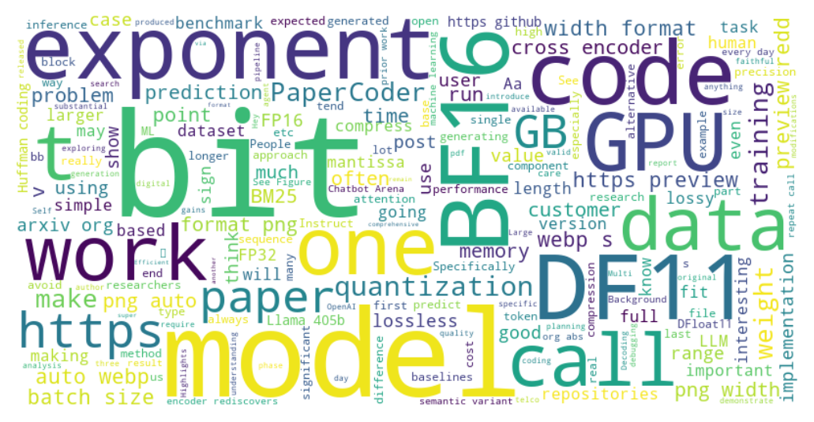

# Reddit-AnalyXer

A web app that fetches and summarizes the latest posts from any Reddit subreddit using NLP.

## Features
- Fetch the latest posts from a subreddit.
- Summarize posts using Hugging Face's `facebook/bart-large-cnn` model.
- Clean text by removing URLs and special characters.
- Deployed using Streamlit Sharing.

## 🎥 Demo



## How to Use
1. Enter a subreddit name (e.g., `MachineLearning`).
2. Adjust the slider to choose the number of posts to summarize.
3. View the summarized posts.

## Live Demo
[Click here to try the app!]([https://reddit-analyxer.streamlit.app/])

## Technologies Used
- Python
- Streamlit
- PRAW (Python Reddit API Wrapper)
- Hugging Face Transformers
- AWS(Sagemaker, S3)

## Installation
To run the app locally:
1. Clone the repository:
    ```bash
    git clone https://github.com/aryanator/Reddit-AnalyXer.git
   
2. Install dependencies:
    ```bash
    pip install -r requirements.txt

3. Run the app:

   ```bash
   streamlit run app.py


---
Contributing
Feel free to open issues or submit pull requests for improvements.

